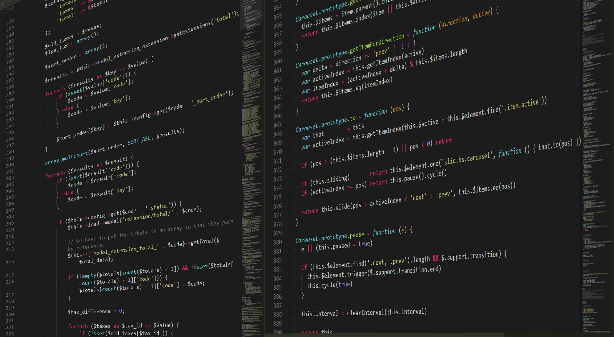

# One hash creates the largest heading (H1)
## Up to six hashes (######) for the smallest heading (H6)

_Emphasis_ and **bolding** as such

Use single backticks for `inline` code.

Use  ```triple backticks``` for block code, start by specifying the language as such;

```py
def hello():
    print ("Hello World!")
```

Ordered list - items with numbers followed by periods.:

1. One
2. Two
3. Three

Unordered list, add dashes ( - ), asterisks ( * ), or plus signs ( + ) in front of items. Indent one or more items to create a nested list.

- One
    - One(a)
- Two
    - Two(a)

Embed a link [Github](https://github.com)

Embed a local image 




Embed an external link - Picsum is a great website for image placeholders 


